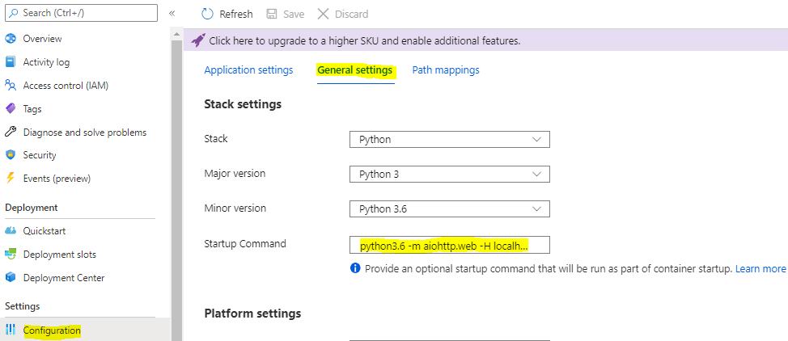
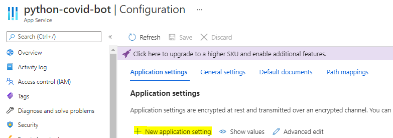
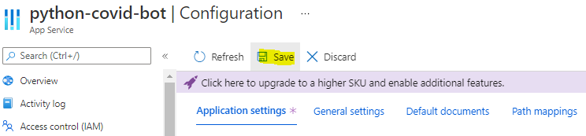

# Covid-Bot

COVID-Bot provides information on COVID-19 symptoms and precautions based on the Irish health service's (HSE) advice.

This application was created as coursework for the Cloud Application Development module in the Certificate in DevOps from [Munster Technological University](https://www.mtu.ie).

Covid-Bot was created using QnA Maker Natural Language Processing (NLP) Service and Azure Bot Framework v4.

## **Provided For Informational Purposes Only!**

The information provided by this chat bot is freely available on the Irish health service's website ([https://www2.hse.ie/coronavirus](https://www2.hse.ie/coronavirus/)) and was current at the time the data was captured (March, 2021). It is not a replacement for professional medical advice. **Please contact your Primary Care Physician or GP if you experience any symptoms!**

## Testing Covd-Bot with Bot Framework Emulator

Microsoft provides a tool for testing bot applications prior to deployment.

For instructions on setting up Bot Framework Emulator, please see:
<https://docs.microsoft.com/en-us/azure/bot-service/bot-service-debug-emulator?view=azure-bot-service-4.0&tabs=python>

If you experience a 401 HTTP status code when using the Emulator on your local PC, then please follow the instructions on how to resolve it in [config.py](config.py).

## Deploying Covid-Bot For The First Time

### Deployment Pre-Requirements

- Azure Subscription.
- Azure CLI installed on your local PC.
- Knowledge Base has been deployed on QnA Maker: [data/QnAMaker/README.md](data/QnAMaker/README.md)

### Deploying Covid-Bot using ARM Templates

Azure Resource Management (ARM) templates define Azure resources as infrastructure as code using JSON files.

Microsoft provides an ARM template for deploying Azure Bots:

- To deploy to an *existing* Resource Group, use: [/deployment/template-with-preexisting-rg.json](/deployment/template-with-preexisting-rg.json)
- To deploy to a *new* Resource Group, use:[/deployment/template-with-new-rg.json](/deployment/template-with-new-rg.json)

To deploy the application, run the following steps:

1. Login using the account linked with your Azure subscription: `az login`
2. Set the subscription ID: `az account set --subscription <subscription_id>`
3. Create an application registration within Azure. This integrates IAM with the app, and allows channels to be integrated with the bot service (e.g.: FaceBook Messenger, Teams, etc.): `az ad app create --display-name "displayName" --password "AtLeastSixteenCharacters_0" --available-to-other-tenants`
4. Deploy the Web App within an *existing* App Service: `az deployment group create --resource-group "<name-of-resource-group>" --template-file "<path-to-template-with-preexisting-rg.json>" --parameters appId="<app-id-from-previous-step>" appSecret="<password-from-previous-step>" botId="<id or bot-app-service-name>" newWebAppName="<bot-app-service-name>" existingAppServicePlan="<name-of-app-service-plan>" appServicePlanLocation="<region-location-name>" --name "<bot-app-service-name>"`

   **OR**

   To deploy the Web App within a *new* App Service: `az deployment group create --resource-group "<name-of-resource-group>" --template-file "<path-to-template-with-preexisting-rg.json>" --parameters appId="<app-id-from-previous-step>" appSecret="<password-from-previous-step>" botId="<id or bot-app-service-name>" newWebAppName="<bot-app-service-name>" newAppServicePlanName="<name-of-app-service-plan>" newAppServicePlanLocation="<region-location-name>" --name "<bot-app-service-name>"`
5. Zip the contents of the Covid-Bot repository using your favourite archiving tool. **The file `app.py` must be at the root of the ZIP file for Azure App Services to find it at startup.**
6. Deploy the ZIP using the following command: `az webapp deployment source config-zip --resource-group "<name-of-resource-group>" --name "<bot-app--name>" --src "path\to\file.zip"`

Please note that the Python Bot deployment differs from the C# and JS Bot Services deployed using the Azure portal, as it creates a 'Bot Channels Registration' rather than the 'Bot Service' resource:

- The Azure App Service default startup command is set for Flask Gunicorn apps rather than aiohttp web server used in covid-Bot.
  To run Covid-Bot, open 'Configuration' > 'General Settings' in the Azure App Service in the Azure Portal and use the following command: `python3.6 -m aiohttp.web -H localhost -P 3978 app:APP`

  

- Functionally, the Web App Bot appears to be more reliable, as an intermittent gateway timeout/service unreachable issue has been observed with the Python SDK.

### Post-Deployment Steps: Set Covid-Bot environment variables

For Covid-Bot to connect with the QnAMaker service, some environment variables need to be set within App Service See [src/config.py](src/config.py).

- MicrosoftAppId
- MicrosoftAppPassword
- QnAKnowledgebaseId
- QnAEndpointKey
- QnAEndpointHostName

'MicrosoftAppId' and 'MicrosoftAppPassword' are set automatically by Azure App Service, but the other variables must be manually declared.

#### Declaring Environment Variables within Azure App Service

1. Open [QnAMaker](www.qnamaker.ai) and sign in with the account linked to your Azure Subscription.
2. Select the Knowledge Base to be used with your bot service.
3. Open the 'Settings' tab, and then note the following values under 'Deployment details':
   - Knowledge Base Id
   - Endpoint Key
   - Endpoint Host Name

4. Open Azure Portal, and navigate to the Azure App Service which is hosting the Bot Framework Service.
5. Select 'Configuration', and then select the 'Application Settings' tab.
6. Select 'New application setting', and then enter the QnA environment variable names along with the values gathered in Step 3:
   - name: `QnAKnowledgebaseId` , value: \<Knowledge Base Id\>
   - name: `QnAEndpointKey`, value: \<Endpoint Key\>
   - name: `QnAEndpointHostName`, value \<Endpoint Host Name\>

   

7. Select Save, once all environment variables have been set. This will restart the App Service.

   

8. Once the environment variables are set and the App Service has been restarted, then open the 'Bot Channels Registration' and select 'Test in Web Chat' to verify that the Bot responds as expected.

## Continuous Deployment of Covid-Bot

Azure Bot Service Deployment Center can automatically generate a GitHub Actions workflow pipeline-as-code file.

GitHub Actions is an event-driven task service which will build and deploy Covid-Bot whenever a commit is made to main branch.

### Deployment Steps Using Azure App Service Deployment Center/GitHub Actions

1. Open the Azure Portal, and navigate to the Azure Bot Service.
2. Select 'Deployment Center' from the left-hand menu.
3. Select the Settings tab, and then select Source: GitHub.
4. Retain the default provider of 'GitHub Actions'.
5. Authorize GitHub, using your GitHub account credentials, if prompted to do so.
6. Select the following values:
   - *Organization*: your GitHub account name.
   - *Repository*: The repo name where your Bot code is stored.
   - *Branch*: The branch from which the code will be deployed (typically 'main').

   

7. Select 'Add a workflow', to automatically generate a workflow file.
8. Select the Build runtime stack as 'Python 3.7'.
9. Select 'Save'.
10. A build should start automatically. Open the 'Logs' tab within Deployment Center to view the deployment history.

### Add Channels to Azure Bot Service

Azure Bot Framework refers to connections to user interface applications as 'Channels'.

A number of handlers are provided by Azure to connect the bot with platforms such as FaceBook, Twitter, Microsoft Teams, Twillio (SMS) and many others.

For more information on connecting Covid-Bot with any of these channels plus several more, please read: <https://docs.microsoft.com/en-us/azure/bot-service/bot-service-manage-channels?view=azure-bot-service-4.0>

*The Coronavirus image used in this repository's logo is available in the public domain from the Center for Disease Control and Prevention's [Public Health Image Library](https://phil.cdc.gov//PHIL_Images/23312/23312.tif)*

*Copyright (c) James Flynn 2021.*
